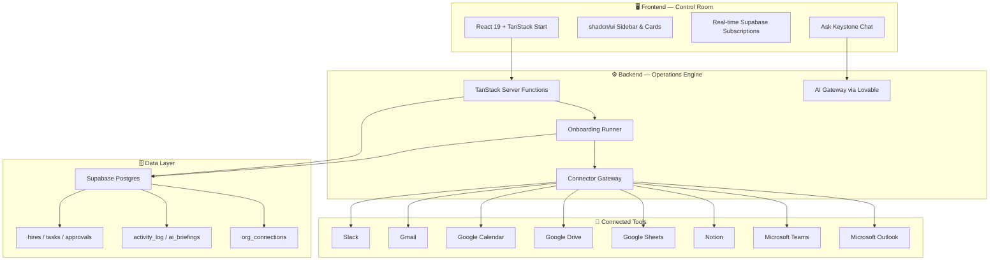

<div align="center">

# 🔶 KEYSTONE

### *The Onboarding Operations Platform for Acropolis*

[](https://onboardaii.lovable.app)
[](https://tanstack.com/start)
[](https://supabase.com)
[](https://ai.gateway.lovable.dev)

</div>

```
┌─────────────────────────────────────────────────────────────────────────────┐
│  ⚡ KEYSTONE CONTROL ROOM v1.0                                              │
│  ─────────────────────────────────────────────────────────────────────────  │
│  🟢 Slack live      🟢 Gmail live      🟢 Calendar live     🟢 Drive live   │
│  🟢 Sheets live     🟢 Notion live     🟢 Teams live        ⚪ Outlook idle │
│  ⚪ Linear idle     ⚪ HubSpot idle     ⚪ Salesforce idle     ⚪ SharePoint idle│
│                                                                             │
│  > Hires in flight: 7    Tasks today: 42    Approvals: 3    Failed: 0       │
│  > AI BRIEFING: "Nikhil needs workspace invite before channel access.       │
│    3 approvals waiting on PII-sensitive roles. No failed runs."             │
└─────────────────────────────────────────────────────────────────────────────┘
```

---

## 🚀 What is Keystone?

**Keystone** is the internal operations cockpit that turns new-hire onboarding from a scattered checklist into a **single, auditable, AI-assisted command center**.

No more "did someone add them to Slack?" No more hunting through Gmail sent folders. No more spreadsheets that are out of date the second you save them. Keystone provisions, tracks, approves, and reports every step automatically — while keeping humans in control of the decisions that matter.

> **One hire. One record. Every tool. Zero chaos.**

---

## ✨ What Makes It Crazy

| Feature | Why It Slaps |
|---------|--------------|
| 🤖 **Daily AI Briefing** | Every morning Keystone reads every hire, task, failure, and pending approval, then writes a plain-English summary + next-actions list. Cached per day. |
| 🧠 **AI Onboarding Plan** | When you create a hire, AI proposes a role-aware checklist across every connected tool. Review it, tweak it, run it. |
| ⚖️ **Approval Risk Copilot** | Every pending approval gets a risk level, recommendation, and reasoning from AI. You still click approve — but now you know *why*. |
| 💬 **Ask Keystone** | Chat with your live onboarding data. "Who starts Monday?" "What failed for Nikhil?" "Re-run Drive provisioning for Sarah." |
| 🔌 **Real Connector Actions** | Slack invites, Gmail welcomes, Calendar bookings, Drive folders, Sheets rows, Notion pages, Teams posts, Outlook fallbacks. Not mock data. Real calls. |
| 🏥 **Live Tool Health** | Every connector shows green/yellow/red status with last-success timestamps. |
| 📜 **Activity Log** | Every action Keystone takes is recorded: tool, hire, outcome, timestamp. Fully auditable. |
| 🔐 **Human-in-the-Loop Approvals** | Sensitive access routes to approvers inside the app (and Slack, if you want). No shadow IT. |
| 🤖 **MCP Agent Ready** | Keystone exposes tools over the Model Context Protocol so external agents can query hires, approvals, and decisions securely. |

---

## 🏗️ Architecture



---

## 🛠️ Tech Stack

| Layer | Tech |
|-------|------|
| **Framework** | TanStack Start (React 19 + Vite 7) |
| **Styling** | Tailwind CSS v4 + shadcn/ui |
| **Backend** | TanStack `createServerFn` on Cloudflare Workers edge runtime |
| **Database & Auth** | Supabase (Postgres + RLS + Auth) |
| **AI** | Lovable AI Gateway → Google Gemini 2.5 Flash |
| **Integrations** | Lovable Connector Gateway |
| **Monitoring** | Microsoft Clarity |
| **Protocol** | Model Context Protocol (MCP) for agent integrations |

---

## 📂 Repository Structure

```
keystone/
├── src/
│   ├── components/          # UI pieces: sidebar, briefing, chat, approval copilot
│   ├── lib/                 # Server logic: runner, connectors, AI, decisions
│   ├── routes/              # TanStack file-based routes
│   │   ├── _authenticated/  # App shell + protected pages
│   │   └── api/             # Public API endpoints + MCP + OAuth
│   ├── integrations/        # Supabase clients, auth middleware, MCP wiring
│   └── styles.css           # Keystone design tokens (dark control room theme)
├── supabase/
│   └── migrations/          # RLS-enabled schema migrations
└── README.md              # You are here 🔥
```

---

## 🎯 The Onboarding Flow

```
1. HR creates a hire in Keystone
        │
        ▼
2. AI proposes a role-aware checklist
   (Slack, Gmail, Calendar, Drive, Sheets, Notion, Teams, Outlook)
        │
        ▼
3. Runner executes each step sequentially
   ──► Invite to Slack workspace
   ──► Create personal Slack channel (#onboard-name)
   ──► Send Gmail welcome email
   ──► Book Day-1 orientation in Calendar
   ──► Book first 1:1 with team lead
   ──► Create Drive onboarding folder
   ──► Append to Sheets tracker
   ──► Create Notion onboarding page
   ──► Post arrival note in Teams
        │
        ▼
4. Sensitive steps route to Approvals
   (PII access, on-call, direct reports)
        │
        ▼
5. AI risk copilot advises each approval
        │
        ▼
6. Dashboard shows live progress, health, and activity
```

---

## 🎨 Design Philosophy

> **Dark-first control room. Warm amber accent. Monospaced metrics. Quiet cards. Thin borders.**

Keystone is designed to feel like the dashboard an operations team actually wants to stare at all day:

- Deep slate canvas reduces eye strain.
- Amber `#ff9f1c` marks the keystone.
- Every metric uses tabular numerals so columns stay aligned.
- Tool chips show real state with live color dots.
- No purple gradients. No generic SaaS hero. Just information, fast.

---

## 🔐 Security & Compliance

- **Row-Level Security (RLS)** on every table. Members only see their org's data.
- **HMAC-SHA256** verification for inbound webhooks.
- **Encrypted connection keys** at rest (`aes-256-gcm`).
- **Security-definer functions** for privileged operations.
- **Human approval gates** for PII, on-call, and direct-report access.
- **No hardcoded secrets** — keys are injected at runtime.

---

## 🚦 Connector Status

| Tool | Status | Actions |
|------|--------|---------|
| Slack | ✅ Active | Workspace invite, channel create, channel access |
| Gmail | ✅ Active | Send welcome email |
| Google Calendar | ✅ Active | Book orientation + 1:1 |
| Google Drive | ✅ Active | Create onboarding folder |
| Google Sheets | ✅ Active | Append to tracker |
| Notion | ✅ Active | Create onboarding page |
| Microsoft Teams | ✅ Active | Post arrival note |
| Microsoft Outlook | ⚪ Available | Fallback welcome email |
| Linear | ⚪ Listed | Not connected |
| HubSpot | ⚪ Listed | Not connected |
| Salesforce | ⚪ Listed | Not connected |
| SharePoint | ⚪ Listed | Not connected |

---

## 🧪 Local Development

```bash
# 1. Clone the cockpit
git clone <this-repository-url>
cd keystone

# 2. Install dependencies
bun install

# 3. Set your environment secrets
#    VITE_SUPABASE_URL, VITE_SUPABASE_PUBLISHABLE_KEY,
#    LOVABLE_API_KEY, *_API_KEY connectors, etc.

# 4. Fire up the control room
bun run dev
```

Open `http://localhost:8080` and sign in. If you're running Acropolis, you're already home.

---

## 🌐 Live URLs

| Environment | URL |
|-------------|-----|
| **Published** | [https://onboardaii.lovable.app](https://onboardaii.lovable.app) |
| **Preview** | [https://id-preview--c1f848f7-4a6f-412d-b063-bcb23181d306.lovable.app](https://id-preview--c1f848f7-4a6f-412d-b063-bcb23181d306.lovable.app) |

---

## 🧭 Roadmap

- [x] Left sidebar app shell + dark control room theme
- [x] AI daily briefing + approval risk copilot + Ask Keystone chat
- [x] Real connector actions across Slack, Gmail, Calendar, Drive, Sheets, Notion, Teams, Outlook
- [x] MCP agent integration surface
- [ ] Advanced analytics & time-to-ready trends
- [ ] Multi-step approval chains with escalation
- [ ] Mobile-optimized control room view
- [ ] Public API for external HRIS integrations

---

## 🙌 Built For

**Acropolis** — the internal organization that believes onboarding should feel invisible to the hire and fully visible to the team.

---

<div align="center">

### 🔶 Keystone — Hold the onboarding world together.

[](https://lovable.dev)

</div>
